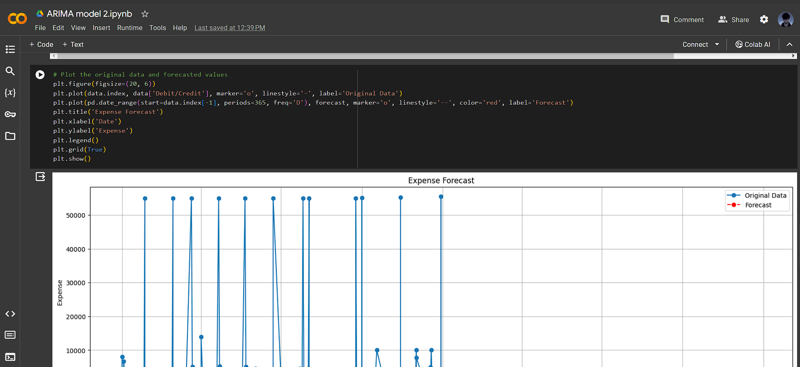

# BillWiseApi

# HM0022 JustInCase

## Develop a solution to improve financial awareness among people, using visualizations, and providing methods to increase savings.

## Description
Develop a solution that improves user’s awareness regarding money savings. The solution can contain
dashboards for easy understanding of their user’s spending and savings. The solution should allow
users to create and manage categories for their expenses (food, health, entertainment, etc.) and
provide visualization of this data.

## Features
- This is a ML api integration code for expense forecasting and predicting next months expense rate

## Tech Stack
- Flutter
- Firebase
- Django

## Screenshots

###API Result
This Api result json is past to flutter for further calculations on the dashboard

### Results
### Previous Year Expense
.png "Previous Year Expense")

### Next Month Forecast Expense
.png "Next Month Forecast Expense")

### Next Year Forecast Expense
.png "Next Year Forecast Expense")

## Video Url
[Link to Demo Video](https://drive.google.com/drive/folders/1jO5_o4o_1UCiCiLQuMnJLvqhgAb4F26K)

## Remarks
- Any additional things you want to share
